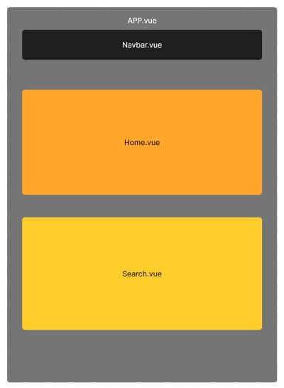

# Milestones
### Go to
1. [Milestone 1](#milestone-1)
    1. [Project Structure](#project-structure)
    2. [Setting the project](#setting-up-the-project)
2. [Milestone 2](#milestone-2)
    1. [More Component](#more-component)
3. [Milestone 3](#milestone-3)
    1. [The Detail Component](#the-detail-component)

## Milestone 1

### Project Structure

<div style="text-align: center; max-width: 300px; margin: 0 auto;">
    
</div>


### Setting up the project
- Create a Navbar component and place it in App.vue;

- Create a Home component and a Search component;
    - Home will be desplayed when App.vue start;
    - Search will be desplayed when user click on the navbar Search;

- Create a ```store``` that can hold a ```boolean```value, telling if we're in the Home or we're launching a search trough the Search Component (default to ```false```);

- Make API https://api.themoviedb.org/3/ work and displaying some movies in the Home component.

## Milestone 2

### More component
- Split the Home Component to hold both Movies and Tv Series;
- Create 2 separate components, one for Movies and one for Tv Series;
- Create a new component for a single movie or a single tv series;
- Get everything to work.


## Milestone 3

### The Detail Component
- Create a new component ``ÌtemDetail.vue``` that will hold the clicked informations and will be displayed when user click on a poster;
- Render conditionally components in ```App.vue```:
    - when in Home a modal will appear if the user click on a poster
    - when in Search a new page will appear when user click on a poster
